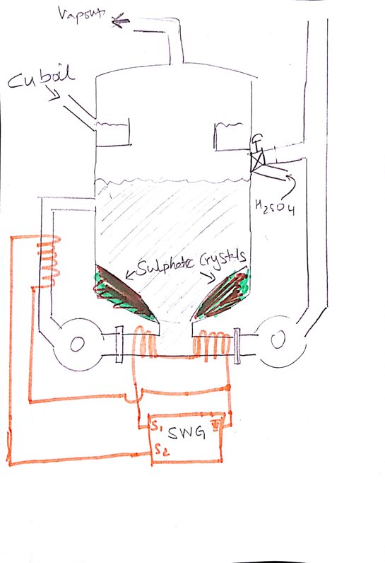
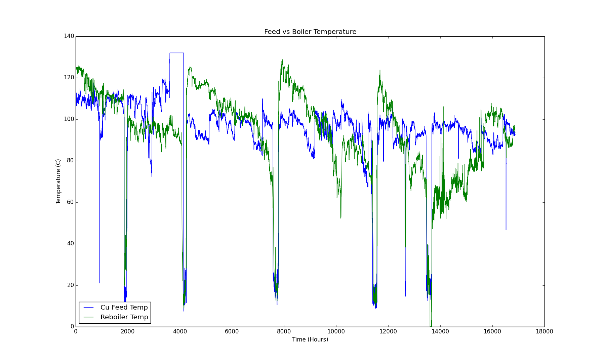
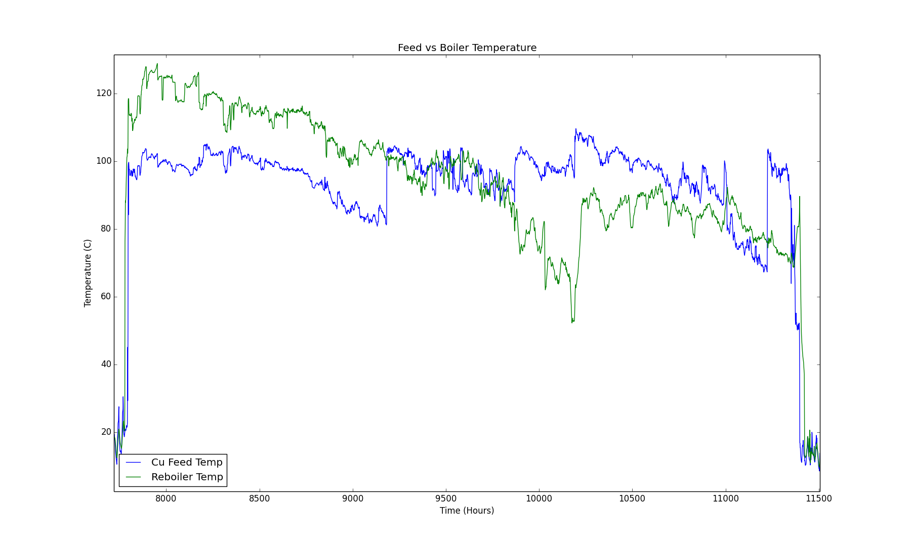
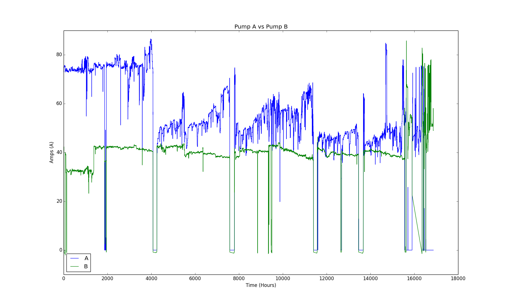
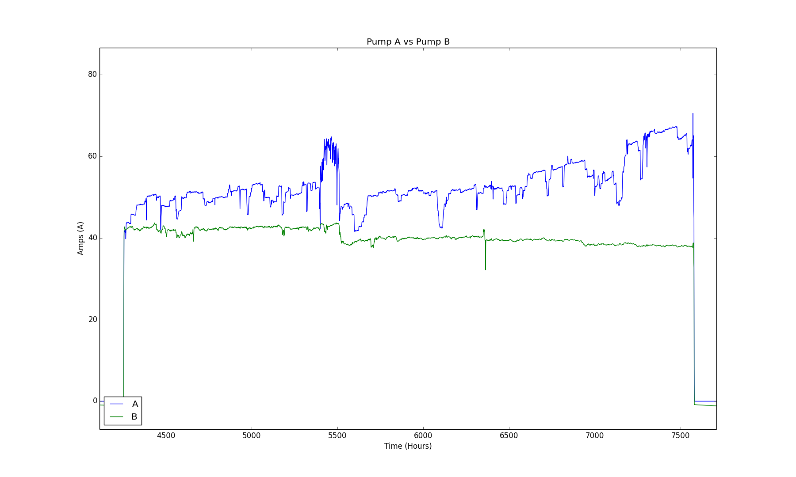

# BHP Nickel West Hackathon

Team Rush Hour submission for the BHP Amazon Hackathon 2018. 

The submission was awarded with the Young Innovator Award 

Unearthed Perth is a 54-hour open innovation hackathon event that features real data and challenges from BHP Nickel West, and see developers, engineers, data scientists, entrepreneurs, and startups, come together to build a prototype solution over the course of a weekend.

## Challenge 1 - Smooth Operator
In short, the goal of this challenge is to prevent shutdowns from solid scale build up in pipes.

**Challenge Description**

At the Nickel West Kwinana Refinery chemical reactions happen in the heat exchangers, tanks and pipework. Over time these reactions cause solid build-up which clogs the system and eventually requires shutdown to clean everything out. 

The Copper Boil Circuit at Kwinana serves the dual purpose of reducing ammonia content and removing copper from the nickel containing liquor to enable the next stage of the process to occur.

A critical issue in the copper boil process is the formation of nickel and copper sulphide scale in the reboiler vessel. This scale builds up over a 6 month period to the point where the circuit can no longer be operated effectively and it must be shut down to hydroblast clean. This requires the whole refinery to be shut down at the same time and therefore represents a large operating cost and production impact.

**Impact and Value**

 Unplanned shutdowns cost approximately $1M in operating cost, and approximately 1000 Nickel tonnes of production.

**Illustration**

## Data Visualisations

## Solution
Using flux to ionize and create turbulence by implementing a control system logic based on the data provided

## Authors
- [Bruce How](https://github.com/brucehow)
- [Haolin Wu](https://github.com/dragonite)
- Shubham Saxena
